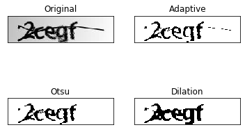

<section>
  
<h3>Word Segmentation using TensorFlow and OpenCV</h3>

	

	

	

 The dataset was taken from a Kaggle competition, and has had around 1000 reCAPTCHA images to train on. I have used two different approaches to solve this problem.

 1) Using OpenCV and creating bounding box for the image using hard-coded dimensions for the bounding boxes as the reCAPTCHA images in the dataset had the letters at the same place for every image.

		

2) Using TensorFlow, I fine tuned the model to achieve 93% test accuracy. I preprocessed the data by normalizing, resizing and splitting, and then built the model with Conv, BatchNorm, MaxPooling Layers.

		

 <a href="https://github.com/yashkarbhari/Word-Segmentation-using-OpenCV">Link</a>

	

	
	

	

	

</section>
